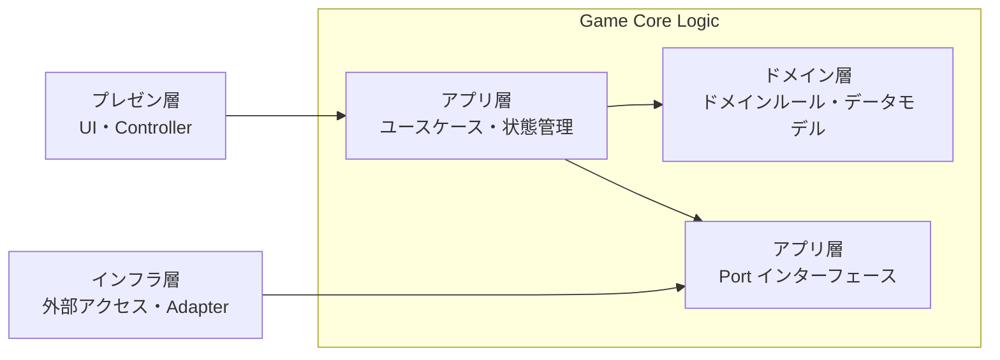

# Clean Architecture の実践 - 対比から得る洞察

## この文書の位置付け

アーキテクチャ設計の心得は、どう設計すべきか？を説明している。  
この文書では、**同じアーキテクチャの「骨格」でも、やりたいことが違えば内部構造がどう変わるか**を、具体的なプロジェクトの対比を通じて説明する。

---

## 共通の骨格

外部リソース（API・外部ライブラリ）に依存する SPA を対象とした、4 層 Clean Architecture。
ゲームロジックを UI・外部リソースから分離するという設計方針を共通ベースとする。



骨格が同じでも、「やりたいこと」の違いが骨格の内側をまったく異なるものにする。

---

## ケーススタディ

### 複雑なドメインを持つカードゲーム

- **やりたいこと**: カードゲームの1人プレイ用シミュレーター
- **設計の中心課題**: 複雑なゲームルールをコードで正確に表現すること
- **複雑性の主戦場**: ドメイン層 - 公式ルールブック 90ページ超、50 種超のカードを実装
- **ドメイン層**: 厚い — 組み合わせ爆発を意味論的な分類で整理する「ルールエンジン」として機能
- **アプリケーション層**: `GameFacade`（プレゼン層の単一窓口）+ `Stores`（動的ゲーム状態）+ `Ports`（インフラへの依存抽象化）
- **インフラ層**: 一種 — カード画像等を取得する外部 API (YGOProDeck API)
- **プレゼンテーション層**: 画面描画 - UI 専用 Store を持つが、ゲームロジックは持たない
- **拡張の単位**: カード 1 枚 = 定義ファイル 1 枚（実装済みの効果の組み合わせであれば既存コードに触れずに追加可能）

**設計上の主要判断**:

カード効果の爆発的な組み合わせ（50 種超）に対処するため、効果を「発動して後から解決される効果」と「継続して適用されるルール」の 2 種に意味論的に分類し、YAML で宣言的に記述する DSL を導入した。  
発動条件・処理ステップ・独自挙動の 3 要素を組み合わせ、既存実装の組み合わせで足りるカードはコードに触れずに追加できる。
既存コンポーネントの組み合わせを優先し、足りない場合のみ新規実装するという原則が、ドメインの肥大化を抑えている。

また、アプリ層のストアは単一ではなく責務ごとに分割されている（ゲーム状態ストア・効果処理キューストア）。
単一 `GameFacade` から見ると窓口は 1 本だが、内部の状態は複数のストアが分担することで、複雑なルール処理の可視化とデバッグを容易にしている。

加えて、プレゼンテーション層なしでゲーム進行を自動テストできるようにしている。
ロジックは極力ドメイン層に寄せることで状態なしで実行可能なテストを書きやすくし、状態が必須な結合テストの量を抑えている。

**ディレクトリ構成**:

```
domain/
├── models/        # データモデル
├── dsl/           # カード定義DSL
├── effects/       # カード効果レジストリ
└── commands/      # ユーザーアクション
application/
├── ports/         # Port インターフェース
├── stores/        # ゲーム状態管理
└── GameFacade.ts  # プレゼン層が利用するゲーム操作の単一窓口
infrastructure/
├── adapters/      # Adapter 実装 (カードデータ API)
└── api/           # 外部 API クライアント
presentation/
└── components/    # Atomic Design
```

---

### 複数ミニゲームの共通基盤

- **やりたいこと**: 外部データに基づくミニゲーム集
- **設計の中心課題**: 複数のミニゲームで、外部リソースを再利用する基盤を構築する
- **複雑性の主戦場**: インフラ層 - 多種の外部リソースを利用
- **ドメイン層**: 薄い — データモデル定義にとどまる
- **アプリケーション層**: ゲームごとのユースケース（`facade` + `store` のセット）、 `Ports`（インフラへの依存抽象化）
- **インフラ層**: 多種 — キャラクター画像等を取得する外部 API (Poke API)、LLM サービス (マルチLLMプロキシゲートウェイ)、2D 物理エンジン（Matter.js）
- **プレゼンテーション層**: 画面描画 - UI 専用 Store を持つが、ゲームロジックは持たない
- **拡張の単位**: ミニゲーム 1 本 = テンプレートに沿った構成セット

**設計上の主要判断**:

ゲームに共通の基底クラスは設けなかった。
各ゲームの状態フィールドはゲーム固有のものが大半を占めるため、基底クラスを作っても継承できるのは一部のユーティリティ（ローディング制御・キャラクター選択など）にとどまると判断し、部分的なユーティリティ関数の再利用に切り替えた。  
結果として、アプリケーション層のユースケース「ゲーム 1 本 = Facade + Store + UI ファイルセット」という明確な追加単位が生まれ、テンプレートに沿って追加するだけでよい構造になっている。

テストもミニゲームごとに書くことができ、プレゼンテーション層なしでゲーム進行を自動テストできるようにしている。

インフラ層には PokeAPI・LLM サービス・2D 物理エンジンの 3 種が混在し、それぞれ変動リスクが異なる。
「どのインフラに依存するか」がミニゲームのモジュール分割軸であり、テンプレートの境界設計の基準になっている。  
特に物理エンジン（Matter.js）は多角形衝突の不安定・貫通・関節振動などの制約があり、Rapier (WASM) への置き換えを実際に検討中。
Port/Adapter の境界が明確なため、移行が必要になっても影響範囲はインフラ層の 2 ファイルに限定される。

**ディレクトリ構成**:

```
domain/
└── models/             # データモデル（PokeData・2dPhysics）
application/
├── ports/              # Port インターフェース
├── stores/             # ゲーム横断の共有状態管理
└── usecases/
    └── GameXXX/        # 各ゲームごとに配置
        ├── facade.ts   # 各ゲーム操作の単一窓口
        └── store.ts    # 各ゲーム状態管理
infrastructure/
├── adapters/           # Adapter 実装（キャラクターデータAPI・LLM・物理エンジン）
└── api/                # 外部 API クライアント
presentation/
└── components/
```

---

## 対比

|                          | カードゲーム                                                                             | ミニゲーム基盤                                                               |
| ------------------------ | ---------------------------------------------------------------------------------------- | ---------------------------------------------------------------------------- |
| **やりたいこと**         | 複雑な 1 つのゲーム                                                                      | 複数のミニゲーム                                                             |
| **設計の中心課題**       | ゲームルールをコードで表現する                                                           | 外部リソースを再利用できる基盤を作る                                         |
| **複雑性の主戦場**       | ドメイン層                                                                               | インフラ層                                                                   |
| **ドメイン層の実装戦略** | カード効果を YAML+DSL で宣言的に記述、コード不変で新カードを追加可能                     | 外部データ扱う正規化モデル                                                   |
| **ドメイン層の厚み**     | 厚い（ルールエンジン）                                                                   | 薄い（データモデル定義）                                                     |
| **アプリケーション層**   | 単一 GameFacade + 責務別 Store 群（gameStateStore / effectQueueStore / chainStackStore） | ゲームごとに Facade + Store のセット                                         |
| **アプリ層の分割軸**     | ゲーム状態の責務（状態・エフェクトキュー・チェーン）                                     | ゲームの種類（ゲーム追加 = ファイルセット追加）                              |
| **インフラ層**           | 一種・安定（外部 API のみ）                                                              | 多種・変動（PokeAPI + LLM + 物理エンジン）                                   |
| **インフラ変動への対処** | Adapter 実装で十分、Port 境界は軽量                                                      | Port 境界を厳格に保持。物理エンジン移行時の影響をインフラ層 2 ファイルに限定 |
| **拡張の単位**           | カード 1 枚                                                                              | ゲーム 1 本                                                                  |
| **テスト戦略**           | ドメイン層中心の構成でステートレスな単体テストが書きやすい。状態が必須な結合テストは少量 | ゲームごとに独立してテスト可能。状態管理の分離でプレゼン層なしに進行を検証   |

---

## 対比から得た洞察

### 複雑性の主戦場を問うことが、設計の出発点

「どこが変わりやすいか」「どこに複雑性が宿っているか」を最初に問うことが、設計エネルギーの集中先を決める。  
アーキテクチャパターンを先に選ぶのではなく、複雑性の在処を見極めてからパターンを当てはめる順番が正しい。

### 同じパターンでも、「何を守るか」で採用理由は変わる

同じ Clean Architecture でも、カードゲームは「複雑なドメインを守る壁」として、ミニゲーム集は「外部インフラを交換可能にする壁」として採用している。  
パターンが同じでも、その内側で設計エネルギーを集中させる層が全く異なる。

### モジュール境界は「揺るがない本質」を軸に引く

本質（ドメイン概念・インフラ種別）を軸に引いたモジュール境界は、コードが増えても安定する。
逆に、技術的都合（ファイルサイズ、実行タイミング）を軸に引いた境界は、機能追加のたびに揺らぎやすい。

### 拡張の単位を定義できた状態が、設計が機能している証拠

「拡張の単位が YAML ファイル 1 枚」「拡張の単位がテンプレートに沿ったゲーム 1 本」と言えるとき、設計は拡張コストを実際に下げている。  
拡張の単位を言語化できない設計は、拡張のたびに全体を把握し直す必要が生じる。

### 分離設計への投資は、変更容易性として回収される

分離設計・実装時の手間（Clean Architecture、Port/Adapter 、Facade 経由の制約、等）はコストとなる。  
しかし、その投資効果は、変更容易性として回収される。
変更容易性の本質は「どの層・どのモジュールを変えればいいかのスコープが明確で、変更が波及しない」ということであり、そのスコープにおけるテストが安全な変更の基盤となる。  
分離設計は、変更容易性・テスト容易性の両方に寄与する。
