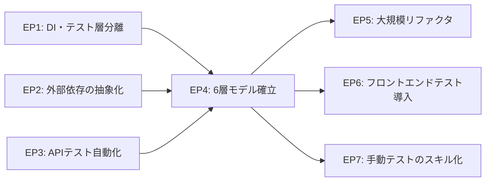

# アーキテクチャとテストの両輪 - 共進化の軌跡

## この文書の位置付け

テスト設計の心得は、テストをどう設計するか？を説明している。  
この文書では、それらのノウハウの礎となった、テストをどう育てたか？のケーススタディを説明する。

一般に、テスト戦略はプロダクトのアーキテクチャ設計の後工程として語られることが多い。  
TDD はその逆で、テストを先に書くことでプロダクション設計を駆動する。  
しかし、実際のプロダクション開発では、どちらか一方が先導するのではなく、**プロダクションのアーキテクチャとテスト層が互いに影響を与えながら、共に成長していく**ことが多い。

この文書では、ある業務アプリケーション（フロントエンド + バックエンドAPP + 外部サービス連携）の開発において、6層のテストアーキテクチャがどのように形成されたかを振り返り、それをケーススタディとして「アーキテクチャとテストの共進化」パターンを抽出する。

---

## 共進化の一般モデル

アーキテクチャとテストの関係を一言で表すと、**「プロダクション → テスト → プロダクション → ...」**の反復である。

```
プロダクションの進化（分離設計、抽象化、リファクタ）
    ⇅
テストの進化（テスト層追加、モック境界の移動、自動化）
```

TDDは「テスト → プロダクション」の一方通行を強調している。しかし、実際の開発では、どちらが先行するかは状況による。  
プロダクション側の設計判断がテスト構造を決めることもあれば、テスト側の限界がプロダクション設計を変えることもある。  
スケジュールの制約や、運用上の痛みがきっかけになることもある。

---

## ケーススタディ: テストアーキテクチャの成長過程

本ケーススタディでは、7つのエピソードを通して、それぞれ異なる方向から共進化が起きた過程を追う。

各エピソードは独立して読めるが、互いに依存関係がある:



各エピソードを経て、結果としてこの6層構造が形成された:

- 層1: コンポーネント単体テスト
- 層2: APP - DB 結合テスト
- 層3: APP - UI 結合テスト
- 層4: APP - 外部サービス結合テスト
- 層5: E2E テスト
- 層6: 業務シナリオテスト

---

### エピソード1: モックの限界が Fake 導入を生み、テスト層を分けた

**起きたこと**:

最初期、PostgreSQL DB を触る単体テストは DBアクセスをモックして置き換えていた。  
しかし、プロダクションコードが成長するにつれ、テストを動かすためのモックも比例して増えていった。
新しいカラムを追加するためにモックを修正し、クエリを調整すればモックの戻り値を修正する - これは保守コストが高く、持続可能ではなかった。

そこで、DBモックを捨て、SQLiteインメモリを単体テストのDBとして導入した。  
DI（依存性注入）でテスト用の SQLiteセッションを差し込み、モックを積み上げなくても実環境に近い動作でテストをかける。  
このようなシーンでは、**DIによるテスタビリティ向上の威力を実感できる。**

一方で、CRUDリポジトリ層のテストには、SQLite では不十分なケースがあった。  
JSONB 演算子、ILIKE の挙動や、Enum型の扱い等 - PostgreSQL 固有の挙動に依存する部分は、SQLite による検証では保証できない恐れがある。
SQLite と PostgreSQL の差異を吸収するための抽象化と保証にコストをかけるよりも、CRUD層だけは PostgreSQL と実際に繋いでテストした方が手っ取り早い。これにより「テストダブルのみで完結する単体テスト」と「実際に PostgreSQL を使う結合テスト」が自然に分離した。  
そして、CRUD層はそこまで頻繁に変更されるわけではないため、DBセットアップが必要となる結合テストを毎回走らせる必要はなく、必要な時だけ実行すれば良い。

こうして、**層1（SQLite での単体テスト）** と **層2（PostgreSQL での DB結合テスト）** が発生した。

**両輪の関係性**:

```
[テスト]: DBモックで最低限のテスト
  ↓
[プロダクション]: テンポよく実装が進む
  ↓
[テスト]: DBモックが持続困難に
  ↓
[プロダクション]: DIを活かして DBセッションを差し替え可能に
  ↓
[テスト]: SQLite インメモリDB を導入
  ↓
[テスト]: SQLite では不十分な CRUD層のテストが結合テストとして分離
```

テストの限界（モックの信頼性崩壊）がプロダクション設計を変えた例。
フェイクDB と本番DB を差し替えられるようにするため、DBアクセス層をリポジトリパターンで抽象化する必要が生まれた。  
テストのために入れた抽象化が、プロダクションの保守性も高めた。

**得られた知見**:

- モックの維持コストが急増したとき、それはテスト層を分けるタイミングのシグナル
- モック→フェイクへの転換により、保守コストが削減されテスト信頼性が向上
- テストのために設けた抽象化は、プロダクション側の設計も改善する副作用を持つ

---

### エピソード2: 並行開発がスタブ設計を生み、取り込みの反復がモック境界を洗練した

**起きたこと**:

本システムが依存する外部サービスは、別チームが担当しており、並行開発する必要があった。
初期に I/F仕様レベルでは合意していたが、実物はまだ存在しなかった。この段階からバックエンドAPP の開発を進めるため、 I/F仕様に基づいてスタブを先に作り、スタブに依存する形とした。

スタブに依存した形で開発を進めることにより、 I/F仕様への要望・改善案などのフィードバックが蓄積され、並行開発中から I/F仕様を調整しブラッシュアップすることができた。

最初期は単一の **`client + stub`** というシンプルな構成で実装していたが、すぐにスタブから実物に繋ぎかえるタイミングが来ることを見据え、**`Protocol + HttpClient + StubClient`** の 3層に分離して DI により環境変数に応じてスタブと実物を切り替える構造とした。

実物との初結合（開発環境上での接続テスト）では、想定通り問題が噴出した。  
が、それらはファイル権限の不一致（uid/gid）や、相対パス/絶対パスの不整合、`None` と空文字の解釈の際などのエッジケースが大半であった。全てアプリ側のワークアラウンドで動く状態にすることができ、そこそこの規模のシステム同士の結合としては驚くほどスムーズに対応することができた。

その後も外部サービスのバージョンアップは繰り返されたが、変更量は回を追うごとに収束していった。  
取り込み作業を繰り返すうちに、「パターン化できてきてる」と気づくようになった。I/F仕様の変更が局所的であれば、スキーマ → Protocol → HttpClient + StubClient + テスト、という一気通貫で変更することができ、アプリ側とは独立して改修することができる。  
最終的にはこの取り込みワークフローを **AIエージェント向けスキル（再利用可能な手順）** として定義し、バージョン番号を指定すれば、変更点確認 → 影響調査 → 実装 → テスト → PR作成まで一気通貫で委任できるようになった。

また、後にこのスタブは並行開発のためだけでなく、実物の外部サービスが必要ないテスト層（UI 結合テスト等）での依存先としても利用されるようになった。

**両輪の関係性**:

```
[プロダクション]: 並行開発のため、2層構造でスタブを実装
  ↓
[テスト]: スタブによる動作確認で I/F仕様をブラッシュアップ
  ↓
[プロダクション]: 本結合を見越してさらに抽象化し、3層構造に分離
  ↓
[テスト]: スムーズな実結合、バグシューティング
  ↓
（取り込みを反復）
  ↓
[運用]: I/F が安定、取り込み作業パターン化、スキル化による大幅な開発効率化
```

並行開発という制約がスタブ設計を強制し、スタブが I/F の仮説として機能した例。  
スタブと本物を繰り返し差し替える過程が I/F設計を洗練させ、テストとプロダクションが共に成長した。テスタビリティは目的ではなく結果だったが、その結果が後続のテスタビリティ（さらなるテスト層分離）の土台にもなった。

**得られた知見**:

- スタブを作る行為は「インターフェースの仮説を立てる行為」と同義
- 差し替えのたびに仮説が検証され、境界設計が収束していく
- 並行開発という実務的な要求が抽象化を駆動し、テスト境界を早期に考えるきっかけになる
- 最初から完璧な抽象化を目指すのではなく、反復の中で洗練させることができる

---

### エピソード3: 手作業のテストから APIテスト層が分離した

**起きたこと**:

初回リリースまでは、実環境のテストは全て手動だった。  
テスト項目はスプレッドシートで管理し、性能計測も手動実行と最低限のスクリプトで行っていた。
機能の大枠は固まっていたが、細かい仕様（バリデーションの境界、フロントエンドとバックエンドのチェックの棲み分け、アプリとしての振る舞い、等）は E2Eテスト項目を洗い出しながら整理していった。
こうしたプロダクション仕様の細部は、テスト仕様と同時に決まっていった。

初回リリース後は、一息ついたタイミングでまずは性能計測をスクリプト化した。手動での性能計測は手間がかかるため、優先度が高かった。
これが独立したテストツールのディレクトリとなり、すぐに `pytest + httpx` ベースのテストスイートとして統合された。

次に、スプレッドシートのテスト項目の中から、APIレベルで自動実行できるものを切り出していった。
性能計測、ワークフロー検証、システム設定変更、これらの機能はブラウザ経由でなくても HTTP リクエストだけで検証できる。
一方、ファイルアップロードや画面表示等、UI と密結合な機能はブラウザ経由での確認が重要であり、E2Eテスト項目として残された。

こうして、もともと1枚のスプレッドシートで管理されていたテスト項目が、**層4（APIコールにより自動実行可能な APP-外部サービス結合テスト）** と **層5（手動で行う価値がある E2Eテスト）** に分離した。

**両輪の関係性**:

```
[テスト + プロダクション]: 手作業でのテスト、詳細仕様整理（並行）
  ↓
[テスト]: 性能計測のスクリプト化、 pytest テストスイート化
  ↓
[テスト]: スプレッドシートの項目の分類
  ↓
[テスト]: API自動化可能なテスト / 手作業に価値があるテスト に分離
```

トップダウンで APIテストを作成したというよりも、詳細仕様整理のためにリストアップされた試験項目が、後にボトムアップで分類され、テスト設計にフィードバックされた例。
開発スケジュールの都合もあり、初手から洗練されたテスト作りにコストをかけるのは難しい。スプレッドシートでテスト項目を網羅的に洗い出す活動は、テストとして重要であることはもちろんのこと、プロダクション設計を確定させていく活動に他ならない。地道な活動であったが、テスト項目として積み上げた資産が、最終的に効率的なテスト層に帰結した。

**得られた知見**:

- 「また同じテストをやっている」という感覚は、自動化レイヤーを切り出すサイン
- 手動テストは、詳細仕様を詰めると同時に、詳細仕様を深く理解する活動でもあり、反復作業は決して無駄にならない
- 手動テストは完全に無くそうとするよりも、これを通じて繰り返しパターンの足掛かりを掴むための初期投資

---

### エピソード4: テスト仕様をスプレッドシートからマークダウンに移行し、6層モデルを確立した

**起きたこと**:

手動テスト向けのテスト仕様書は当初 Googleスプレッドシートで管理していた。
スプレッドシートは、初期段階のテスト項目の洗い出しには便利だった。
テストコードは GitHubリポジトリ上で管理されていたが、テストコードと手動テストは重複していなかったため特に問題はなかった。  
しかし、手動テストの一部が APIテストコードとして分離し始めた時から、二重管理の問題が顕在化した。

そこで、テスト仕様をリポジトリ内で一元管理することを決意し、マークダウンへの書き直しに着手した。
もはやテストコードの各ケースを書き下す必要はなく、整理・検討の末に **検証観点 × 層ごとの配置のマトリクスによるカバレッジマップ** で表現する形に落ち着いた。  
実行コストを鑑み、常に CI自動実行される層と、必要なタイミングでテスト記録用の Issue を起票して証跡管理する層に分かれた。
これにより「6層モデル」が確立した。

また、テスト記録用Issueテンプレートと、そこで実際に使用するテスト仕様を管理するマークダウンを作成し、**テスト仕様書（クラス）と実施記録（インスタンス）** を分離するモデルも確立した。
そして、マークダウン化されたテスト設計・テスト仕様書と、テストコード、Issueに記録されたテスト証跡が一元管理された資産となり、さらなるテスト仕様のブラッシュアップにつながるサイクルが回り始めた。

**両輪の関係性**:

```
[テスト]: スプレッドシートでの項目管理、各層での試行錯誤
  ↓
[ドキュメント]: 6層モデルテスト設計の体系化、カバレッジマップ、テスト仕様マークダウン
  ↓
[テスト]: テスト実施、証跡記録、ブラッシュアップのサイクル形成
  ↓
[プロダクション + テスト]: ドキュメント - テストコード - プロダクションコードの一気通貫の整合性確認
```

ドキュメント管理改善の必要性がきっかけとなり、ボトムアップで育った様々な既存テスト資産が、トップダウンの整理（6層モデル確立）として帰結した例。
点と点が線として繋がり、互いにフィードバックしながら改善するサイクルとして回り始めた。

**得られた知見**:

- スプレッドシートは初期の項目洗い出しには便利だが、時が来たら移行コストを払ってでも一元管理に移行する価値がある
- ボトムアップで育ったテスト資産は、トップダウンであらためて整理・命名することで全体像が見える
- 全体を俯瞰することで不足している層が浮かび上がり、そこを層として命名することで「予約」することもできる

---

### エピソード5: プロダクションの混沌がリファクタを駆動し、テストが安全網となった

**起きたこと**:

出発点はテストではなく、プロダクションコードの問題だった。  
もともと、ルーター層とサービス層は完全に分離せず、複雑な非同期処理（ワークフロー制御）のみルーターから切り出し、それ以外のビジネスロジックはルーターに直接書いていた。
初期段階はこの方がシンプルで実装が早く、意図的な設計判断によるものだった。

しかし、プロダクションコードが成長するにつれ、ルーター層が単なるワークフロー呼び出しのための薄いラッパーではなく、ビジネスロジックを持つものが増えてきた。
そろそろ、ルーター層（HTTP翻訳）とサービス層（ビジネスロジック）を分離するという一般的なベストプラクティスに移行するべきか、という意識が生まれた。

大規模リファクタには通常それなりのリスクがあるが、HTTPレベルのルーター層テストが **層1（バックエンド単体テスト）** および **層4（APP-外部サービス結合テスト）** として整備されており、ブラックボックステストとして機能していた。
このテストを固定した状態でリファクタリングを進めることで、安全にプロダクションコードを変更できた。

さらに、リファクタ完了後は、層1テストもルーター層・サービス層で分ける形で再編できた。
HTTP翻訳レベルの観点と、ビジネスロジックレベルの観点を分離することで、テストケースの見通しを改善することができた。

**両輪の関係性**:

```
[プロダクション]: ルーター層の肥大化という課題
  ↓
[プロダクション]: 大規模リファクタリング（テストは据え置き）
  ↓
[テスト]: テスト再編（プロダクションは据え置き）
```

リファクタリングの必要性が生じた時点で、それまでに積み上げたテストが安全網として機能し安全に改善できた例。  
表裏一体のプロダクション・テストの片方を固定し交互に変更することで、両方を安全に進化させることができた。

**得られた知見**:

- テストへの投資は「いざ変更するとき」に回収される
- リファクタ中は「テスト固定→プロダクション改善」の順を守ることで、変化の原因を追跡できる
- 安全に変更できることが保険となり、「今は分離構造よりもシンプルさを優先する」という設計判断も安心して下せるようになる

---

### エピソード6: フロントエンドテストは一旦「我慢」し、どの部分なら自動化できるか？から再設計した

**起きたこと**:

フロントエンドの WebUI画面は、大まかな画面数と画面遷移までは決めていたものの、細部は完全に手探りだった。  
そのため、E2Eテストの自動化は初めから「保留」とし、手作業で確認・検証する方針としていた。
もともとフロントエンド側に重たいロジックを入れる予定はなかったこともあり、ローカルでの動作確認をベースに、スピード優先で開発を進めていた。

開発を進めて「動く画面」が形になっていくことで様々な気づきがあり、細かい変更や調整も必要になってきた。ポーリングやメッセージのハンドリングなど、フロントエンド側へのロジック実装も徐々に増えていった。
巨大ページ・重複コードなども少なからず発生してしまったが、それでもこのフェーズでは機能的な改善を優先し、「我慢」して開発を続けた。  
手作業での E2Eテストは手間が大きく大変だったが、初回メジャーリリースを控えていたこともあり、これも「我慢」してテストした。

初回メジャーリリースの開発に目処がついた段階で、**層1（フロントエンドの単体テスト）** と **層3: APP - UI 結合テスト** の自動化に着手した。
この時点で、フロントエンドの層1テストのカバレッジは 0%で、層3の結合テストは完全に手作業だった。
フロントエンドのテスタビリティもあまり考慮されていなかった。

ここでは、どの部分ならテスト自動化しやすいか？という観点で、明確な目的を持ってリファクタリングを計画した。  
巨大ページを分析し、純粋関数として切り出せる処理や、特に共通処理を洗い出した。
ページからビジネスロジックをユースケース層に分離し、純粋関数にして、層1テストとして自動化した。  
また、バックエンドAPIと通信するクライアントツールも刷新し、分離することで、バックエンドAPIアクセスを層3テストとして自動化できた。
この際、層2（APP-DB結合テスト）や外部サービススタブの方式を流用することで、容易に実APIサーバーとの結合テストを実装できた。

**両輪の関係性**:

```
[プロダクション]: 手探りで流動的だったため機能実装優先
  ↓
[テスト]: 「我慢」する判断をして腹を括り、テストは高負荷になったとしても受け入れる
  ↓
[リリース]: 無事、マイルストーンを達成
  ↓
[プロダクション]: テスト自動化という明確な目的を持ってリファクタリング
  ↓
[テスト]: プロダクションのテスタビリティ向上によりテストカバレッジも向上
```

手探りフェーズの機能実装スピードとテスタビリティを天秤にかけ、徐々に高負荷になっていくテストを「我慢」して受け入れた例。  
「最善」の選択ではなかったかもしれないが、トレードオフとして「次善」を意図的に選択したことで覚悟が決まり、マイルストーンを達成できた。
その後、今まで我慢した分のバックログを一気に消化し、短期間でリファクタリング・テストカバレッジ向上を実現。

**得られた知見**:

- テスト層の導入にはタイミングがある。手探りフェーズでは機能実装を優先し、テストは苦労するしかないこともある
- 険しい道も、あらかじめ覚悟を持っておくことで乗り越えられる
- リファクタリングとテスト層を「予約」しておくことで、時が来たらスムーズに実装できる

---

### エピソード7: 手動テストのオペレーションはAIエージェントに委任した

**起きたこと**:

業務シナリオテストはユーザーの業務フローをなぞる必要があり、手作業で行うことに意味がある。そのため、自動化せずに手動テストをする方針としていた。  
しかし、手作業のシナリオテストは想像以上に過酷だった。  
システムライフサイクルの業務シナリオは、セットアップ、初期設定、動作確認、アップデート、ロールバック、などの手順を実行する。
そのため、テストのたびにリフレッシュ済みのクリーンな環境を用意し、手順書の検証を兼ねて手作業でオペレーションを行う必要がある。
加えて、これを複数ショット回す必要があった。

1回目のテストは、手順書もスクリプトも出来たての状態でのテストだった。
テスト中に手順書の不備を発見し、スクリプトを修正し、パッケージを再作成する - 実質的に「開発の一部」だった。見つかる問題の数も圧倒的に多い。
それでも、これは「テスト期」と位置付けられている。そのため「テスト期なのに先が見えない」「テスト期なのにまだ開発が全然片付いていない」という、先の見えない感覚に苛まれることもあった。

2回目でようやくテストが安定し、討ち漏らしを片付けて 3回目のテストで「何も問題ないことの確認」となるはずだった - リリース直前の確認テストで新たな問題が見つかり、修正と再テストが必要になった。バッファとして 計画していた 4回目のテストを行い、ようやく完了となった。

このような地道で泥臭いテストは過酷だったが、資産も残った。  
それは、上から記載通りに実行できるよう丁寧に記載された「手順書」と、その手順の実行ログを細かく記録したテスト証跡である。
これを分析することで、手順書の検証と確実な証跡確保を両立する手法の確立につながった。  
それは、手順書を読み込み、記載通りにオペレーションを実行し、マークダウンで整備したテスト仕様書から作成した Issue に証跡を記録しながら、テスト進行状況を可視化する - 一連のオペレーションを自律実行する AIエージェントのスキル定義である。
これにより **層6（業務シナリオテスト）** が大幅に効率化され、問題となっていた「1回のテスト」を、早期に、高速に回すことができるようになった。

**両輪の関係性**:

```
[テスト]: 手動シナリオテスト 4回完遂、苦労の連続
  ↓
[プロダクション]: 高品質な手順書・スクリプトが完成
  ↓
[テスト]: 詳細な実行ログ・証跡を含むテスト記録
  ↓
[運用]: 蓄積された資産からテストオペレーションをAIエージェントに委任可能に
  ↓
[テスト]: テストオペレーション自動化と問題検知の早期化、「1回目問題」の解消
  ↓
[テスト]: ただし、「最後の1回」だけは人間が確認する方針
```

地道な手動テストの反復により蓄積した資産が、大幅なテスト効率化につながった例。  
ユーザーにとって明確でわかりやすい手順書の作成と、テスト品質向上のために残した詳細なテスト記録が、AIエージェントにとっても理解しやすく、実行しやすい形の成果物となっていた。これがテスト品質をさらに高め、問題検知が早期化し、プロダクションの品質も向上するというフィードバックループが生まれた。

**得られた知見**:

- 1回目のテストは「開発の一部」
- 手動テストを「操作」と「判断」に分離すると、委任可能な範囲が見えてくる
- 人間が読んで理解しやすい手順書・記録は、AIにとっても実行しやすく再現性が高い
- 自動化の目的は「人間をなくすこと」ではなく「人間が判断に集中できること」

---

## 得られた知見まとめ

### テスト層は、アーキテクチャから「生える」

テスト層はトップダウンで設計してから追加する - というアプローチは教科書的に正しいが、実際はアーキテクチャの変化に応じて自然に分離・出現するものである。
新しいテスト層が欲しくなるタイミングは、プロダクション側で責務の分離が進んだサインである。  
逆に、テストのために設けた抽象化がプロダクション設計を改善することもある。共進化は一方通行ではない。

### 「テストが書きにくい」は設計改善のシグナル

テストの複雑化・モックの肥大化・テストがすぐ壊れる、これらは熟練のテスト技法によって解決する問題 - ではなく、プロダクション側の設計問題の投影であり、設計にフィードバックするためのシグナルである。  
テストを書きやすくするためにプロダクション設計を改善する。これは TDD の「テストを先に書く」とは異なるアプローチだが、同じゴール - テスタビリティの高い設計 - を目指している。

### リファクタリングでは「テスト固定→プロダクション改善」と「プロダクション固定→テスト改善」を交互に行う

大規模なコード変更はリスクが高い。最も危険なのは、プロダクションコードとテストコードを両方同時に変えてしまうことである。
両方を同時に変えると、テストが落ちたとき、何が壊れたのか - プロダクションのバグか？テストのミスか？ - が判断できなくなる。片方を固定して交互に改善を進めることで、変化の原因を追跡できる。

### テストという安全網が、設計判断の自由度を広げる

テストが整備されていると「いざとなれば変更できる」という安心感が生まれる。
これにより、「今はシンプルさを優先し、後で分離する」という設計判断も安心して下せるようになる。テストへの投資は、変更時の安全網であると同時に、現時点の設計選択肢を広げる保険でもある。

### ボトムアップの成長 + トップダウンの整理

各テスト層は、現場の痛みから必要に迫られてボトムアップで育つ。
しかし、ある程度育ったら、トップダウンで整理・命名することで全体像が見え、次の成長の土台になる。  
このように、成長はリニアではなく、漸進（ボトムアップの蓄積）と飛躍（トップダウンの整理）の繰り返しである。

### テスト導入にはタイミングがある

テストは早く書くほど良い、とも限らない。
早すぎるテスト自動化は仕様変更で無駄になったり、テストのメンテナンス自体が開発を阻害するブレーキになってしまうリスクもある。
しかし、テスト整備が遅れると、徐々に手動テストのコストが増え、変更コストが嵩んでいく。

「我慢」と「諦め」は違う。待つべき時は待ち、苦労することを覚悟した上で意図的に次善を選ぶ。覚悟があるからこそ、時が来たときに一気に返済できる。

### 手動テストは、仕様を確定させる活動でもある

E2Eテスト項目を洗い出す過程で、バリデーションの境界やFE/BEの責務分担など、プロダクション仕様の細部が決まっていく。「テスト＝確認作業」という認識にとどまらず、「テスト＝仕様発見の場」として位置付けると、手動テストの価値が全く変わる。

### 手動テストは「作業」と「判断」に分離できる

手動テストの意味は「人間が目で見て判断すること」であり、「人間が手でコマンドを打つこと」ではない。
この二つを分離することで、手動テストの効果を保ちつつテスト効率・オペレーション精度を向上できる。  
ただし、この分解は手動テストを十分に繰り返し、何が「作業」で何が「判断」なのかを体感した後に、やっと見えてくることもある。

### シナリオテストの「初めの1回」は検証ではなく開発と位置付ける

シナリオテストを計画する際、各ショットは平等ではなく、役割が異なる。
実績のないテストはまだ「検証」ではなく、「探索」であることもある。
これは「テストで失敗した」のではなく、「成果物がまだ仕上げ前だった」のである。
そのため、最初の1回はテストというよりも仕様の発見プロセスとして位置付けることが堅牢なテスト計画につながる。
そして、その最初の1回をいかに早期に高速に回すか、が開発プロジェクトのリスクを大きく減らすことにつながる。

### 地道な反復から得る蓄積と気づきが、効率化・自動化の土台になる

各エピソードは、どれも同じ道筋を辿っている - 地道に手作業を繰り返す中で資産を蓄積し、気づきを得て、次回で再利用可能なパターンになる。  
泥臭い手作業の繰り返しが高品質な成果物・記録を生み、それがAIエージェントへの委任やスキル定義の土台となることもある。
人間が読んで理解しやすい成果物・記録は、AIにとっても理解しやすく再現性が高い。そして、それが AI によって生成される成果物の品質も高める。
プロフェッショナルの仕事を地道にこなすことが、最短経路なのである。
