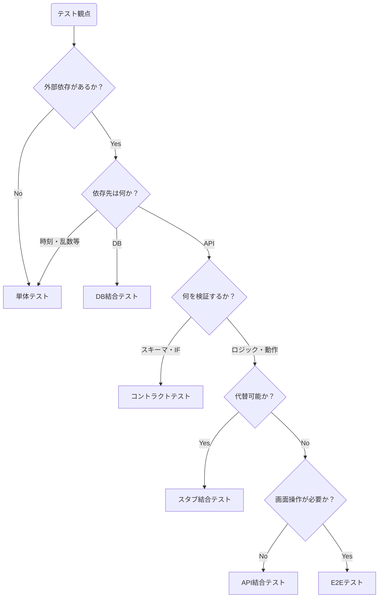

# テスト層割り当てチートシート

テスト観点を「どの層で検証するか」を検討するための早見表

---

## 判断フローチャート

---

## 観点別割り当てパターン

### バリデーション系

| 観点                                | 推奨層     | 備考                         |
| ----------------------------------- | ---------- | ---------------------------- |
| 入力値（型・範囲・必須）            | 単体       | 純粋ロジック。外部依存なし   |
| ファイル形式・拡張子                | 単体       | 同上                         |
| ファイルサイズ上限                  | 単体 + E2E | ロジックは単体、性能は実環境 |
| ビジネスルール（例: 残高 ≥ 引出額） | 単体       | 純粋ロジック                 |
| DB ユニーク制約・外部キー制約       | DB結合     | 実 DB が必要                 |
| フォームのバリデーションエラー表示  | E2E(手動)  | UI 動作の確認                |

### CRUD 系

| 観点                                   | 推奨層           | 備考                          |
| -------------------------------------- | ---------------- | ----------------------------- |
| CRUD基本操作                           | DB結合           | SQL／ORM の実動作を検証       |
| フィルタ・ソート・ページネーション     | DB結合           | 同上                          |
| API経由のCRUD操作                      | API結合          | HTTP/JSONのシリアライズを検証 |
| 検索・フィルタ・ページネーションの API | API結合 + DB結合 | DB + API の連携確認           |
| ステート遷移・トランザクション         | 単体 + DB結合    | ロジックは単体、永続化はDB    |
| UI経由のCRUD操作                       | E2E              | 主要シナリオのみ              |

### 外部サービス連携系

| 観点                                     | 推奨層                          | 備考                                               |
| ---------------------------------------- | ------------------------------- | -------------------------------------------------- |
| 正常系・異常系レスポンスの処理           | 単体(モック)                    | 固定レスポンスで分岐網羅。外部との実通信は不要     |
| 異常系の振る舞い（タイムアウト・503 等） | 単体(モック) + スタブ結合テスト | 再現コストが高い。モックorスタブは状況に応じて     |
| 外部サービスを含む自チームコードの動作   | スタブ結合テスト                | 外部をスタブで代替し、自チームコードを実際に動かす |
| API スキーマ整合性                       | コントラクトテスト              | サービス間の IF 合意を E2E から切り出して独立検証  |
| パフォーマンス                           | API結合(実物)                   | 実環境でないと意味がない                           |

### UI 系

| 観点                             | 推奨層             | 備考                                                   |
| -------------------------------- | ------------------ | ------------------------------------------------------ |
| APIクライアントのリクエスト構築  | 単体               | 実際のHTTP送受信は不要                                 |
| APIレスポンスのパース・変換      | 単体               | 同上                                                   |
| FE-BE間のスキーマ整合性          | コントラクトテスト | FE をコンシューマ、BE をプロバイダとして IF 合意を検証 |
| ユーザー操作の主要フロー         | E2E(自動)          | シナリオ単位で代表ケースのみ                           |
| レイアウト・デザインの視覚確認   | E2E(手動)          | 機械的に判定できない                                   |
| レスポンシブ対応・クロスブラウザ | E2E(手動)          | デバイス・環境依存                                     |

---

## アンチパターン

### E2E で全てをテストする（逆ピラミッド）

- **何が起きるか**: テストが遅く・不安定になり、CI のフィードバックループが壊れる
- **対処**: 純粋ロジックを分離し、単体・インテグレーションで担保できる観点を下の層に分離する
- **チェック観点**: この観点は画面を操作しないと確認できないか？を問う

### モックで安心する（偽りの安全）

- **何が起きるか**: モックでテストをパスしたのに、本番連携でバグが発生する
- **対処**: モックは「替える理由がある」ものに限定し、実通信の確認はインテグレーションで担保する
- **チェック観点**: このモックは実際の挙動と乖離していないか？を問う

### 全ての層で同じ観点をテストする（無駄な重複）

- **何が起きるか**: テストの変更コストが高くなり、保守が追いつかなくなる
- **対処**: 委譲を明記し、単数または少数の層で担保する
- **チェック観点**: ある仕様変更の検証のために、動かすor書き直すテストが多過ぎないか？を問う

### 判断を書かずに省略する（サイレント漏れ）

- **何が起きるか**: 後任者が「テスト漏れ」と誤解し、重複テストを追加する
- **対処**: カバレッジマップに「この観点は〇〇層で担保するため、この層では検証しない」と明記する
- **チェック観点**: カバレッジマップに空欄がないか？を問う
