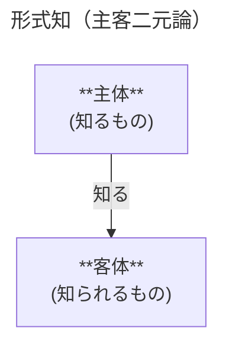
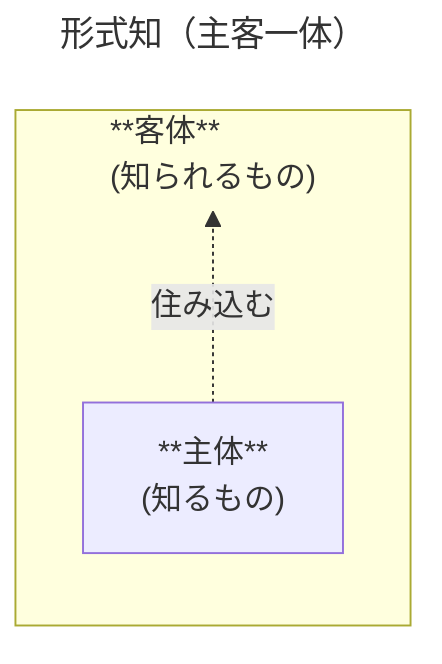
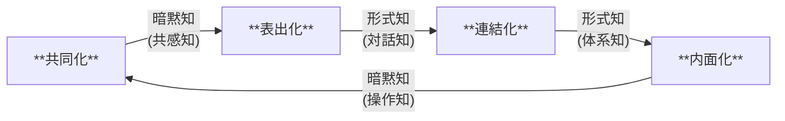

# SECIモデル（組織的知識創造プロセス）まとめ

SECIモデルは、「知識創造企業」（野中 郁次郎・竹内 弘高 著 - 1996年）にて提唱された、組織的な知識創造のフレームワーク。
西洋哲学的な認識論に基づく経済理論/経営理論/組織論を批判的に捉え、高度経済成長を遂げた1980年代の日本企業を分析して構築された「日本人発」の理論。

**参考**:

- [暗黙知の次元](https://www.chikumashobo.co.jp/product/9784480088161/)
- [知識創造企業](https://nonaka-ik.org/nonaka/books/219.html)
- [The Wise Company](https://nonaka-ik.org/nonaka/books/1668.html)

---

## 前提: 形式知と暗黙知

暗黙知の概念は、マイケル・ポランニー（ハンガリーの物理化学者→社会学者→科学哲学者）が命名した。  
この概念の登場以前は、「知識」とは形式知だけを指していた。

| 区分 | 形式知                             | 暗黙知                         |
| :--- | :--------------------------------- | :----------------------------- |
| 性質 | 客観的な知（組織知）               | 主観的な知（個人知）           |
| 認知 | 精神的な知（理性知）               | 身体的な知（経験知）           |
| 構造 | 順序的な知（ロジカルに説明できる） | 同時的な知（結論だけ出てくる） |
| 表現 | デジタルな知（符号化された知）     | アナログな知（生データの集積） |

**「形式知」（暗黙知という概念が登場する以前からあった「知識」のイメージ:**

- 主体（観察者）と客体（対象）は分離独立している（主客二元論）
- 単に「言語化された情報」を指しているのではなく、「正当化された真なる信念」を指す

**マイケル・ポランニーによる「暗黙知」のイメージ:**

- 主体は客体に住み込み（自己投入）、「内面化」する
- 一体化しているため、主客を分離する（人間的要因を恣意的に排除する）ことはできない
- 単に「言語化できない知」「まだ言語化されていない知」を指しているのではなく、「主客が一体化・内面化した状態でしか存在できない、行為と不可分の知」を指す

---

## 背景: 西洋的価値観と日本的価値観

SECIモデルは、西洋的な知識観・経営理論を批判的に捉え、日本的価値観を取り込んで構築されている。

### 価値観の対比

| 西洋的価値観                                             | 日本的価値観                     |
| :------------------------------------------------------- | :------------------------------- |
| 大陸合理論（デカルト） vs 英国経験論（ロック）           | 主客一体                         |
| 弁証法（カント・ヘーゲル・マルクス）                     | 心身一如                         |
| 現象学（フッサール） vs 分析哲学（ウィトゲンシュタイン） | 自他統一                         |
| 二元論的、形式知を重視                                   | あまり二元論ではない、暗黙知寄り |
| 二項対立→統合→次の対立 という流れ                        | 曖昧、そもそも体系化されていない |

### 西洋の経済理論/経営理論/組織論

「科学主義」と「人間主義」が対立しつつ発展してきた。

| 科学主義                           | 人間主義                           |
| :--------------------------------- | :--------------------------------- |
| 計画的・分析的な「管理」を重視     | 組織文化・マインド・人間関係を重視 |
| 人間を機械のように捉えている       | 士気・帰属意識などに着目している   |
| トップダウン型・ヒエラルキー型     | ボトムアップ型・フラット構造       |
| 形式知偏重型（有能なトップに依存） | 暗黙知偏重型（有能な個人に依存）   |

いずれも「知識」を重視しつつも静的なものとして捉えており、組織的な「知識創造プロセス」という動的なものとしては捉えられていない。  
原典（知識創造企業）は、この問題点を指摘し、日本的価値観を取り込んで再構築を試みている。

---

## SECIの4プロセスモデル

SECIモデルは、暗黙知と形式知の知識変換を、サイクルするプロセスとして捉えたモデル。
`SECI` は4つのプロセスから頭文字をとったもの。

| プロセス                        | 変換            | 場                                   | 内容                                                                                                                                     |
| ------------------------------- | --------------- | ------------------------------------ | ---------------------------------------------------------------------------------------------------------------------------------------- |
| **共同化** (Socialization)   | 暗黙知 → 暗黙知 | **創出の場** (Originating Ba)     | 個人間または小グループ内で、観察・模倣・共同体験を通じて暗黙知を共有する 例: 徒弟制度、OJT、合宿                                      |
| **表出化** (Externalization) | 暗黙知 → 形式知 | **対話の場** (Dialoguing Ba)      | 個人または小グループが有する暗黙知を、対話・メタファー・アナロジーを通じて概念・言語として表現する 例: コンセプト開発、ドキュメント化 |
| **連結化** (Combination)     | 形式知 → 形式知 | **システムの場** (Systemizing Ba) | 表出した形式知が小グループを超えて流通し、分類・統合されて新たな形式知が生み出される 例: 会議、データ分析、マニュアル整備             |
| **内面化** (Internalization) | 形式知 → 暗黙知 | **実践の場** (Exercising Ba)      | 創造され流通している形式知を個人が実践・反復し、身体化・内面化する 例: 実地訓練、ロールプレイ、シミュレーション                       |

「場」とは知識創造が起きる**共有コンテキスト（物理的・仮想的・精神的な空間）**を指す概念。SECIの各プロセスは対応する「場」が設計・維持されることで初めて機能する。

**エンジニアリング文脈での具体例:**

- 共同化: モブプロ、ペアプロ、レビュー指摘、ブレスト、顧客ヒアリングによるドメイン理解
- 表出化: レビュー指摘のチェックリスト化、ブレストのドキュメント化（ADR等）、AIエージェントスキル化、コーディングそのもの
- 連結化: ベストプラクティス、ガイドライン、テンプレートリポジトリ、ライブラリ（組織を超えた再利用）
- 内面化: 写経、ハンズオン、既存プロジェクトへのオンボーディング、ベストプラクティスの適用

**補足:**

原典（知識創造企業）では、ネット上などでよく見かける説明よりも深い意味を持たせている:

- **表出化**: 単なる「マニュアル化」ではなく、「コンセプト化」に近い。まずメタファー・アナロジーを活用し、その後でロジックを組む。
- **連結化**: あるコンセプトが認められ、プロトタイプとして具現化したりすることで、グループを超えて意気投合する。これによってさらに抽象化され上位のコンセプトや組織ビジョンに結びついたりする。
- **内面化**: あるコンセプトが成功事例となり、個人やグループが触発されたり、組織文化が形成されたりする。

---

## 組織的知識創造スパイラルと5フェーズモデル

SECIの4プロセスモデルを拡張する概念として、以下の2つの軸を考える:

- **認識論的次元 (Epistemological Dimension)**: 形式知 ↔ 暗黙知 の変換軸
- **存在論的次元 (Ontological Dimension)**: 知識が展開される範囲の軸（個人 → グループ → 組織 → 組織間）

SECIプロセスを「認識論的次元」を表すモデルと捉え、これに直交する「存在論的次元」を考える。  
SECIプロセスが循環するたびに知識の流通・適用範囲が広がっていき、個人の暗黙知が組織全体の知識として昇華される。  
このダイナミクスを **「知識創造スパイラル」** と呼ぶ。

5フェーズモデルはこれを時間軸で記述したもので、前フェーズに戻りながらも全体としてスパイラルに進む。

| フェーズ               | 対応するプロセス | 内容                                                                                   |
| :--------------------- | :--------------- | :------------------------------------------------------------------------------------- |
| **暗黙知の共有**       | 共同化           | メンタルモデルや技能を共有しつつ、信頼関係を構築する                                   |
| **コンセプトの創造**   | 表出化           | メタファーやアナロジーを活用し、コンセプト（形式知）を打ち出す                         |
| **コンセプトの正当化** | 連結化の前提条件 | コンセプトが形式知となったことで評価可能となり、組織・マネジメント層により正当化される |
| **原型の構築**         | 連結化           | 各部門が連携し、既存知識を総動員してプロトタイプを具現化する                           |
| **知識の移転**         | 内面化 → 共同化  | 成功事例として組織全体に共有され、組織文化・次サイクルの起点となる                     |

**知識創造スパイラルを促進する組織的要件:**

知識の源泉は「個人の暗黙知」であり、組織はそれを増幅するものと捉える。  
以下の要件が、「個人」の知識創造と、「組織」のスパイラルを促進する。

- **組織の意図（ビジョン）**: 個人の思考・行動を方向づけ、コンセプトを正当化する際の基準となる。
- **自律性**: 決まり事は最小限にとどめ、最大限の選択肢・解釈の余地を残す。個人の自由な思考・行動を促し、それが偶発的な機会や情報との接触機会を増やし、知識創造のきっかけとなる。
- **ゆらぎと創造的カオス**: 組織内外から受ける刺激や、個人ごとの解釈の違いによる議論など。これらの矛盾・批判的思考が、常識・ルーティンを揺さぶり、ブレイクスルーのきっかけになる。
- **情報冗長性**: 情報が、直ちに必要としない人にも共有されること。個人やグループ同士が、直ちに必要としない関係性・ネットワークを持っていること。
- **最小有効多様性**: 環境変化に適応するために必要となる、異なった視点や考え方。ただし、組織を維持するためは単一性も必要であるため、それとバランスする程度の多様性レベルである必要がある。

---

## 弁証法との関連

SECIモデルは弁証法と構造的に類似している。
原典（知識創造企業）でも、ヘーゲル弁証法を参照しつつ、日本的に再解釈している。

| 弁証法                            | SECIモデル                                                         |
| :-------------------------------- | :----------------------------------------------------------------- |
| テーゼとアンチテーゼの対立        | 暗黙知と形式知の対立・相補性                                       |
| アウフヘーベン（止揚）→ジンテーゼ | 知識変換による新たな知の創造                                       |
| ジンテーゼが次のテーゼとなる      | 内面化した知が、次の共同化の起点となる                             |
| 量質転化                          | 表出化・内面化（暗黙知・形式知が量的に蓄積され、質的変化を起こす） |
| 螺旋的な発展                      | 存在論的次元が個人→組織→社外へと拡大                               |

ただし、弁証法が二項対立の「統合」を核心とするのに対し、SECIモデルは共同化（暗黙知→暗黙知）という「対立なき共鳴」のステップを含む。  
これは日本的価値観（主客一体）の影響であり、西洋弁証法をそのまま適用していない点がSECIモデルの独自性となっている。

---

## マネジメントへの適用

### 管理スタイルの提案: ミドル・アップダウン・マネジメント

SECIモデルを組織で機能させるための管理スタイル論。  
トップダウン・ボトムアップに次ぐ「第三の選択肢」として提唱された。

| 管理スタイル             | 長所                         | 短所                               | 具体例                                     |
| :----------------------- | :--------------------------- | :--------------------------------- | :----------------------------------------- |
| **トップダウン**         | 明確な方向性・迅速な意思決定 | 現場の暗黙知を活かせない           | 軍隊・製造業の指示命令系統                 |
| **ボトムアップ**         | 現場の知識・自律性を活かせる | 組織ビジョンとの整合が弱い         | スタートアップ・研究組織                   |
| **ミドル・アップダウン** | ビジョンと現場を橋渡しできる | ミドルの負荷が高く人材確保が難しい | ホンダのワイガヤ・キヤノンのミニコピア開発 |

ミドルマネジャーは **「ナレッジ・エンジニア」** として機能する——トップが掲げる大局的なビジョン（しばしば曖昧・矛盾を含む）と、フロントラインが直面する混沌とした現実を橋渡しし、暗黙知を吸い上げて形式知に変換し、組織に流通させる。

### 組織構造論の提案: ハイパーテキスト型組織

SECIモデルを継続的に機能させるための組織構造論。  
従来の2つの組織形態が抱える欠点を補うものとして提唱された。

**従来の組織形態の限界:**

| 組織形態             | 長所                       | 短所                                                       | 具体例                             |
| :------------------- | :------------------------- | :--------------------------------------------------------- | :--------------------------------- |
| **ビュロクラシー型** | 効率的・安定・再現性が高い | 硬直しており知識創造に向かない。イノベーションが起きにくい | 官僚組織、大企業の既存部門         |
| **タスクフォース型** | 柔軟・自律的・創造的       | プロジェクト解散後に知識が散逸する。組織に蓄積されない     | プロジェクトチーム、コンサルチーム |

**ハイパーテキスト型組織とは:**

従来の2つの組織形態を排除せず、相互補完的に同時に機能させる構造として、3つの層を「同時に共存」させるモデルを提案している。

| 層                         | 性格             | 特徴                                                       |
| :------------------------- | :--------------- | :--------------------------------------------------------- |
| **プロジェクト・チーム層** | 知識創造の場     | 流動的・自律的。ビジョン達成のため一時的に編成される       |
| **ビジネス・システム層**   | 日常業務の遂行   | 階層的・効率的。通常時の主な活動の場                       |
| **知識ベース層**           | 組織の記憶・基盤 | 部門ではなく「場」。文化・ビジョン・暗黙知が蓄積される基底 |

ビュロクラシー型の強みはビジネス・システム層が、タスクフォース型の強みはプロジェクト・チーム層がそれぞれ担い、知識ベース層が両者をつなぐ記憶として機能する。

重要なのは「3層が並存する」だけでなく、**メンバーが文脈に応じて層を行き来できる**点にある。

- メンバーは普段ビジネス・システム層で日常業務に従事しつつ、必要に応じてプロジェクト・チーム層に移り、完了後に戻る
- プロジェクトで創造された知識は知識ベース層に蓄積され、次のサイクルの起点となる
- 知識ベース層は独立した部門ではなく、他の2層に浸透する基底。組織文化・ビジョン・暗黙知がここに生きている

この「どの層にも自在にアクセスできる」という流動性が、1995年当時のWebのハイパーテキスト（単一の文脈に縛られず、リンクを辿って別の文脈に即座に移動できる）をメタファーとしている。

**ミドル・アップダウンとの関係:**

この2つの提案は補完的な関係にある。  
ハイパーテキスト型組織が「構造（何層があるか）」を定義し、ミドル・アップダウン・マネジメントがその構造を動かす「人の動き（誰がどう橋渡しするか）」を定義する。  
ミドルマネジャーは3層を行き来しながら、各層で生まれる暗黙知を形式知に変換してサイクルを回す存在といえる。

---

## 「知識創造企業」への批判

- **反証可能性の欠如**: こじつけ力が高い「優秀なモデル」である反面、暗黙知の変換プロセスを反証できる形で定義していないため、科学理論としての厳密性に欠けるという批判がある。
- **暗黙知の外化可能性への疑問**: ポランニー自身は暗黙知の完全な言語化を否定しており、「表出化」の概念は原典と矛盾している。
- **実証的根拠の薄さ**: バブル期の少数の日本企業の成功事例（ホンダ・キヤノン等）からの帰納的理論化であり、普遍性に疑問が残る。また、成功事例ばかりを対象としており、失敗事例への説明が少ない。
- **日本文化の特殊性**: 日本型組織文化（集団主義・OJT重視等）を前提としており、他文化圏での適用に限界がある可能性がある。
- **測定・操作化の困難さ**: 暗黙知の量や変換プロセスを定量的に測定・評価する方法が確立されていない。
- **インセンティブ設計の欠如**: 個人が知識を自発的に共有することを暗黙の前提としており、共有のメリットやインセンティブの設計が理論に含まれていない。
- **ミドルマネジャーへの過剰要求**: ミドルマネジャーをある種「魔法の杖」のように扱っている。そうした人材の育成・確保・評価の方法は理論に含まれておらず、現実的ではない。
- **時間軸・成果予測の困難さ**: どのフェーズにどれだけ投資すれば、いつ成果が出るかを予測する方法が示されておらず、経営判断の根拠にしにくい。
- **IT・デジタル化との相性**: KMS（ナレッジマネジメントシステム）の実装において、「暗黙知をデータベース化する」という形式知還元主義的な運用が横行しやすい。これはSECIモデルの「暗黙知は人と人との共同体験を通じてしか伝わらない」という本質に反しており、ツールの整備が「共同化」の代替になると誤解されるリスクがある。

---

## 後続研究：フロネシス（実践知）

SECIモデルが「知識創造の構造」を示したのに対し、「知識を何に向けるか」という**目的論・倫理的次元**に着目し、「フロネシス（実践知）」と「賢慮型リーダーシップ」の概念を展開した。

**アリストテレスが提唱した3種の知:**

| 知の種類 | 原語           | 内容                                     |
| :------- | :------------- | :--------------------------------------- |
| 理論知   | エピステーメー | 普遍的・科学的な知識                     |
| 技術知   | テクネー       | ものを作る技術・スキル                   |
| 実践知   | フロネシス     | 文脈・状況に応じて適切に判断・行動する力 |

**SECIモデルとの対比:**

|              | SECIモデル                 | フロネシス                             |
| :----------- | :------------------------- | :------------------------------------- |
| 中心問題     | 知識をどう創造・変換するか | 何が「善い」かを文脈の中で判断できるか |
| 知識の種類   | 形式知 ↔ 暗黙知            | 実践知（理論知・実践知を超えた層）     |
| 組織への含意 | SECIプロセス・場の設計     | 賢慮型リーダーシップの育成             |

**賢慮型リーダーシップの6能力**:

1. 善い目的を判断する能力
2. 本質・文脈を読む能力（場の状況把握）
3. 場を創る能力（共有コンテキストの設計）
4. 本質を語る能力（メタファー・比喩で伝える）
5. 政治力・人を巻き込む・束ねる能力（矛盾や対立に立ち向かう）
6. 実践知を組織全体に育む能力

---

## 所感・考察（原典を読んで）

### SECIモデル自身がSECIモデルの実例になっている

- 原典「知識創造企業」を読んでみたら、元々のイメージとは少し異なっていた。
  - 情報は欠損し、わかりやすい部分だけが伝えられるということを実感した。「暗黙知」「形式知」に対するイメージも深まった。
- 原典（暗黙知的な深い理解に基づく形式知）→ネット上の解説（受け取った形式知に基づく形式知）の過程で、認識論的な背景や「コンセプト化」の本質が落ちて、「マニュアル化しましょう」という表面的な話だけが流通している。
  - SECIモデルにおける「表出化」無しに、「連結化」（ネット記事という形での流通）に進んだ結果と言えるかもしれない。理論が「形式知」として広まるほど、その理論の源となった「暗黙知」から遠ざかってしまうのかもしれない。
  - SECIモデルが他の組織で「使えない」と感じられやすいのも、「連結化された成功モデル」だけが移転され、「共同化フェーズが先にある」という本質が抜け落ちるためかもしれない。
- これはSECIモデルへの批判でもある「暗黙知は完全には形式化できない」の証左かもしれない。（ポランニーへの回帰）
  - SECIモデルは「知識を表出化できる」と主張しているが、SECIモデル自身がその伝播過程で暗黙知的な深みを失っている。
- このドキュメント自体が、原典を読んでみた上で、自分の経験から得た暗黙知を踏まえて「表出化」しようとする試みとも言えるかもしれない。

### 暗黙知→形式知の変換は「非可逆圧縮」である

- 暗黙知→形式知はある種の「符号化」であり、情報は不可逆に欠損する。
  - 原典を読む前は、なんとなく「形式知」の方が優れたものだと思い込んでいたが、実際には形式知はあくまで知識の一形態にすぎない。
  - 形式知は「完成品」ではなく「非可逆圧縮の成果物」であり、切り離せない隠れ層として暗黙知が存在している。というより存在していなければならない（アイスバーグモデル）
  - 形式知にして終わりではなく、スパイラルの新たな出発点として捉えることが重要（青は藍より出でて藍より青し）
- システム設計でも、現実世界→ドメインモデルへの変換（符号化）で必ず情報が落ちる。
  - 「どの情報を落とすか」の判断そのものが設計者の暗黙知でもあり、ドメインモデルはその意思決定の結果としての生み出された形式知と言える。
  - 優れたドメインモデルとは「現実を完全に表現したもの」ではなく「目的のために何かを捨て、意図的に洗練されたもの」、という感覚はSECIモデルの理解と一致する。

### 「情報」と「知識」と「データ」

- 「情報」と「知識」は異なる。書かれてさえいれば「形式知」ではないし、言語化できないだけでは「暗黙知」ではない。
  - インターネットによって情報の「流通コスト」が極端に小さくなり、「情報の濁流」にどう対処するか？という点が課題になってきている。情報が多すぎて何を信じたら良いかわからない。
  - さらに、生成AIによって情報の「生産コスト」までも極端に小さくなり、「情報の氾濫」にどう対処するか？という点も課題になってきている。膨大なゴミ情報が生み出され、ただ「多い」だけでなく、玉石混合の割合が加速度的に変化している。クソと味噌を見分ける必要がある。（そして、このテキストも例外ではない）
  - そういった意味では、「古典」への再注目が重要だと思う。新しいものは次々に生み出され、いずれは古くなり淘汰される。が、古典はすでに時の試練を超えて生き残った安心と実績がある。新しいものは古くなるが、古いものは古くならない。
- SECIモデルは1990年代の理論なので、「データ」の位置付け（「情報」と「データ」の区別）が弱い。
  - データは形式知よりもさらに「生」な状態（符号化以前のアナログ情報に近い）とも言えるし、逆に高度に構造化された形式知とも言える。データの形態が「デジタルデータであること」は、その質を表現していない。
  - LLMは膨大な量のテキストデータから何かを獲得したり、処理したりできるようになった。これは「共同化」や「内面化」をすっ飛ばしているようにも見える。
  - 暗黙知-形式知の二項に「データ」をどう位置付けるかは、AI時代のSECIモデルのアップデートとして考える余地がある。
  - SECIモデルを、コンテキストエンジニアリング（何を渡し、何を捨てるか）と対比させてみても面白いかもしれない。

### 「科学的」なアプローチだけが唯一絶対ではない

- 原典を読む前は、なんとなく科学的・定量的な方法が最善という思い込みがあった。
  - しかし、科学には「現在の技術で計測可能なものしか見えないという制約」があり、科学信仰には色々なものを見なくなってしまう、見えなくなってしまうリスクもある。それが、形式知偏重・暗黙知軽視に繋がっているのかもしれない。
- ただし、SECIモデル自体がこの点で自己矛盾を抱えてもいる。「計測可能でないもの・科学的ではないものにも価値がある」ということを、理論（形式知）によって体系化しようとしている。
  - これは「暗黙知を形式知化することの限界」を説きながら、自分もその限界に踏み込んでいる構造といえる。
- 反証可能性の観点での批判や、「こじつけ力が高い＝優秀なモデル」という見方は、この矛盾を自覚した上でのユーモアであり、本質的な限界の示唆でもある

### 共同化の「場」をどう設計するか

- 平成生まれにとってはどうしても意外に感じてしまうが、日本にも強かった時代があった。
  - ウォーターフォール・モデルの全盛期ともいえる1980年代に、ラグビースタイル（チーム一丸となっての製品開発）を実践していた。日本企業は、アジャイルソフトウェア開発宣言（2001年）以前からアジャイル的な精神を重視していたともいえる。
- 近年は否定されがちな文化（例:飲みニケーション）が、強みとして捉えられていた。
  - まさに、SECIモデルの観点でいう「知識創造を促進する組織の要件」を複数同時に満たす「場」として機能していた。
  - 逆に言えば、飲み会そのものが重要なのではなく、非公式で心理的安全性が高く、暗黙知が自然に流通する「場」が重要なはず。リモートワーク時代にこれをどう設計するか？は未解決の問題。
  - （リモートワーク推進派には不都合な真実: 「距離は知識を殺す」）
